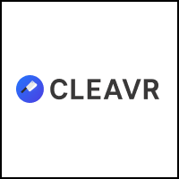
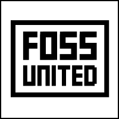
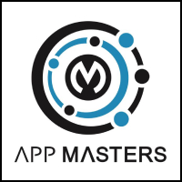
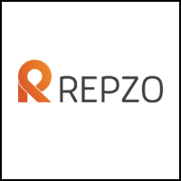
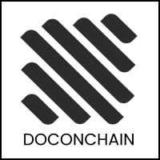
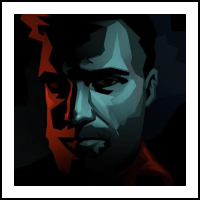

  

 

  <h3>
    <a href="https://www.patreon.com/adonisframework">
      Business Sponsors
    </a>
  </h3>

  

  

  

 

  <h3>
    <a href="https://www.patreon.com/adonisframework">
      Patreon Supporters
    </a>
  </h3>

  

  

  

  

  

  

  

  

 

  <h3>Fullstack MVC framework for Node.js</h3>
  
AdonisJs is a fullstack Web framework with focus on <strong> ergonomics and speed </strong>. It takes care of much of the Web development hassles, offering you a clean and stable API to build Web apps and micro services.

 

[![gh-workflow-image]][gh-workflow-url] [![npm-image]][npm-url] ![][typescript-image] [![license-image]][license-url] [![snyk-image]][snyk-url]

  <h3>
    <a href="https://adonisjs.com">
      Website
    </a>
     | 
    <a href="https://docs.adonisjs.com">
      Guides
    </a>
     | 
    <a href=".github/CONTRIBUTING.md">
      Contributing
    </a>
  </h3>

  Built with ❤︎ by <a href="https://github.com/thetutlage">Harminder Virk</a>

[gh-workflow-image]: https://img.shields.io/github/workflow/status/adonisjs/core/test?style=for-the-badge
[gh-workflow-url]: https://github.com/adonisjs/core/actions/workflows/test.yml "Github action"

[npm-image]: https://img.shields.io/npm/v/@adonisjs/core/latest.svg?style=for-the-badge&logo=npm
[npm-url]: https://www.npmjs.com/package/@adonisjs/core/v/latest "npm"

[typescript-image]: https://img.shields.io/badge/Typescript-294E80.svg?style=for-the-badge&logo=typescript

[license-url]: LICENSE.md
[license-image]: https://img.shields.io/github/license/adonisjs/adonis-framework?style=for-the-badge

[snyk-image]: https://img.shields.io/snyk/vulnerabilities/github/adonisjs/core?label=Snyk%20Vulnerabilities&style=for-the-badge
[snyk-url]: https://snyk.io/test/github/adonisjs/core?targetFile=package.json "snyk"
