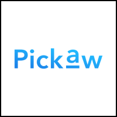
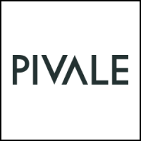
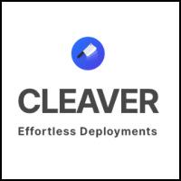
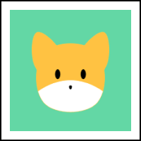

  

 

  <h3>
    <a href="https://www.patreon.com/adonisframework">
      Patreon Supporters
    </a>
  </h3>

  
 Shout out to individuals and companies supporting the creator of the framework 

  
  

  

  

  

  

  

  

  

  

 

  <h3>Fullstack MVC framework for Node.js</h3>
  
AdonisJs is a fullstack Web framework with focus on <strong> ergonomics and speed </strong>. It takes care of much of the Web development hassles, offering you a clean and stable API to build Web apps and micro services.

 

[![appveyor-image]][appveyor-url] [![circleci-image]][circleci-url] [![npm-image]][npm-url] ![][typescript-image] [![license-image]][license-url] [![audit-report-image]][audit-report-url]

  <h3>
    <a href="https://adonisjs.com">
      Website
    </a>
     | 
    <a href="https://adonisjs.com/docs">
      Guides
    </a>
     | 
    <a href="CONTRIBUTING.md">
      Contributing
    </a>
  </h3>

  Built with ❤︎ by <a href="https://github.com/thetutlage">Harminder Virk</a>

[appveyor-image]: https://img.shields.io/appveyor/ci/thetutlage/core/master.svg?style=for-the-badge&logo=appveyor
[appveyor-url]: https://ci.appveyor.com/project/thetutlage/core "appveyor"

[circleci-image]: https://img.shields.io/circleci/project/github/adonisjs/core/master.svg?style=for-the-badge&logo=circleci
[circleci-url]: https://circleci.com/gh/adonisjs/core "circleci"

[npm-image]: https://img.shields.io/npm/v/@adonisjs/core/alpha.svg?style=for-the-badge&logo=npm
[npm-url]: https://www.npmjs.com/package/@adonisjs/core/v/alpha "npm"

[typescript-image]: https://img.shields.io/badge/Typescript-294E80.svg?style=for-the-badge&logo=typescript

[license-url]: LICENSE.md
[license-image]: https://img.shields.io/github/license/adonisjs/adonis-framework?style=for-the-badge

[audit-report-image]: https://img.shields.io/badge/-Audit%20Report-blueviolet?style=for-the-badge
[audit-report-url]: https://htmlpreview.github.io/?https://github.com/adonisjs/core/blob/develop/npm-audit.html "audit-report"
